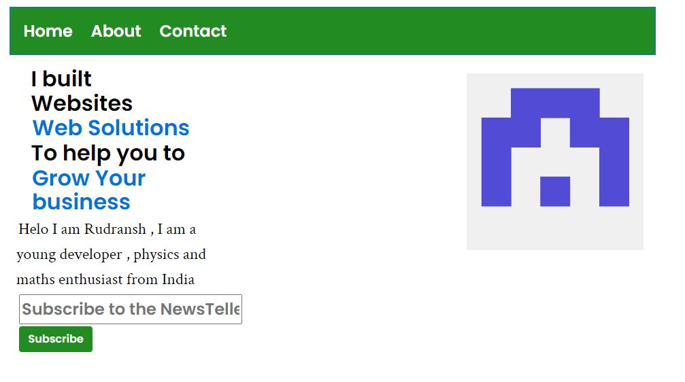

  

#  NextGenCSS 🔥

<div align="center">
  
  <h1>NextGenCSS🔥</h1>
  <p>A flexible and fast CSS framework with your custom utility names...</p>

  [](https://choosealicense.com/licenses/mit/)
  [](https://opensource.org/licenses/)
  [](http://www.gnu.org/licenses/agpl-3.0)
  
  
</div>

You can change the utility name as you want in a simple click for team....
# Now no need to learn any name of classes and check documentation

This is a fast easy CSS framework for your next project . It will provide a bunch of features to fast your development process and make writing CSS fast !!!


## !!! Version 0.1 released


  

  

##  Author

  

-  [@rudransh61](https://www.github.com/rudransh61)

  
  
  
  
  

##  Documentation

Learn this CSS library of next generation .

[Documentation](https://nextgencss.gitbook.io/untitled/)

Learn this in 4 minutes , check wiki page for Beginners's Guide
[wiki](https://github.com/rudransh61/NextGenCSS-/wiki/Learn-it-in-4-minutes-...)

** v0.1 released introducing new features :-
  - Curve border classes
  - Some templates for copy paste
  - Navbar Component
  # NOTE:- The documentation for v0.1 is not updated yet , we will update it as fast as possible

##  Contributing

  

Contributions are always welcome!

We want developers who are the future of next generation to transform this small project.

  

See `CONTRIBUTING.md` for ways to get started.

  
  

##  🚀 About Me

[Check here!!](https://github.com/rudransh61)

  
  
## How to Use it ?

Firstly , Use it if you want to create custom syntax for you team's CSS classes , or want your own names in a CSS library

To use it Install the project (For installation check below).

Install all dependencies

Then change the file `/src/syntax/_syntax.scss` and change the name of your wish like

```scss
$syntax : (
  ...other code
  padding : "my-padding",
  ..other code
); 

```

And then Run `build.sh` file in root folder
```shell
$ build.sh
```

Now you can copy the file `/src/index.css`
and use it in your project

##  Installation

  

Install my-project with git
```bash

git clone https://github.com/rudransh61/NextGenCSS-.git

``` 

  

```bash

cd  src

```

##  Run Example File Locally
  
Open the ```index.html``` file in ``` ./example``` directory

 - You can see example project directly from this [codepen](https://codepen.io/rudransh61/pen/bGzLZzY) link 

 - You can also use replit templates [template](https://replit.com/@Rudransh61/NextGenCSS-Starter-Template) link


# Main CSS file to Include

``` .\src\index.css  ``` file .
  

##  Support

  

For support, contribute with us .
Or sponsor if u want

  
  

##  Usage/Examples

  

```html

<!DOCTYPE html>
<html lang="en">
<head>
    <meta charset="UTF-8">
    <meta name="viewport" content="width=device-width, initial-scale=1.0">
    <title>Document</title>
    <link rel="stylesheet" href="https://cdn.jsdelivr.net/gh/rudransh61/NextGenCSS-/src/index.css" media="print" onload="this.media='all'">
</head>
<body>
    <h1>Namaste 🙏</h1>
</body>
</html>

```

## Examples of websites you can create 

- Design simple and beautiful websites FAST !!



- Responsive also


## VIDEO


https://github.com/rudransh61/NextGenCSS-/assets/115872354/08cf0c1a-3afa-4269-b8c1-8d1fc48e5900


## Thanks to our Contributors !!!!!
<!-- Copy-paste in your Readme.md file -->

<a href = "https://github.com/rudransh61/NextGenCSS-/graphs/contributors">
  
</a>

Lets Make it to 100🌟

## Star History

[](https://star-history.com/#rudransh61/NextGenCSS-&Date)


Thanks 😁
