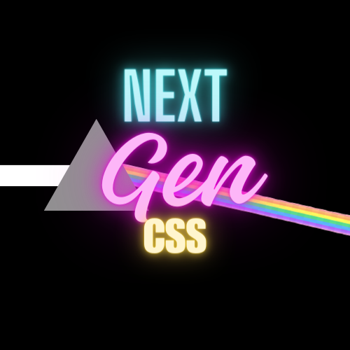

# 🔥 NextGenCSS🔥

<figure><figcaption></figcaption></figure>

Introducing a new fast easy to learn CSS framework for your traditional HTML files .

🔥  blazingly fast

🎓 easy to learn

🤝 small but growing community&#x20;

## What it includes ? and Why should I use it ?

<figure><figcaption>
Me : *a new framework came yesterday
</figcaption></figure>

This new framework helps you to design websites faster by including&#x20;

* Custom tag for some components&#x20;
* In-built Optimizations like lazy-load and more....
* Pre-built components to use in form of HTML tags
* Default styling of some tags

Not only this , in future we are looking to add more features and make it production ready ...

## Use case to use it in real life

Not every framework are made for very giant apps, This is not built for making a new big giant SaaS , there are other framework for these kind of apps

It is made to make your life easy with very easy to learn Roadmap to learn it , and start making some websites in it.

Yes it is in currently developing phase , so there may be some bugs and errors .

We had implemented many different features , but if you have any new idea about any feature , We will be happy to implement your idea in real-world .&#x20;
