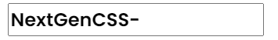

# Input Box


## Input Box

There is a default style for input button , so,  you don't have to  add anything else for it just use `<input>` tag.

```html
<input class="input-alert" type="text" value="NextGenCSS-">
```

<figure><figcaption><p>output</p></figcaption></figure>
