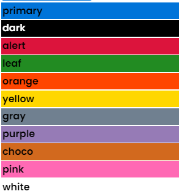

# BackGround Color


## Background Color

To set **BackGround Color** use **`.bg-{...}`** class

### Syntax

`.bg-{...color-name}`


## **Examples**

```html
<div class="bg-primary">primary</div>
<div class="bg-dark font-white">dark</div>
<div class="bg-alert">alert</div>
<div class="bg-leaf">leaf</div>
<div class="bg-orange">orange</div>
<div class="bg-yellow">yellow</div>
<div class="bg-gray">gray</div>
<div class="bg-purple">purple</div>
<div class="bg-choco">choco</div>
<div class="bg-pink">pink</div>
<div class="bg-white">white</div>
```

<figure><figcaption><p>output of example</p></figcaption></figure>
