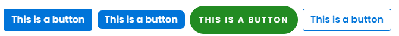

# Buttons

## Syntax&#x20;

```sass
...other code
    button : "btn",
...other code
```

## Buttons

_Buttons classes are of **4** kinds_

* **`button`** on tag it is the default style you don't need any class for this
* **`.btn-curve`** button with curvy edges
* **`.btn-bootstrap`** buttons like our favourite bootstrap buttons
* **`.btn-circle`** with more circular edges

## **Examples**

```html
<button class="">This is a button</button>
<button class="btn-curve">This is a button</button>
<button class="btn-circle">This is a button</button>
<button class="btn-bootstrap">This is a button</button>
```

<figure><figcaption></figcaption></figure>
