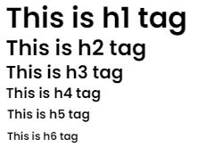
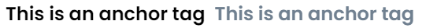
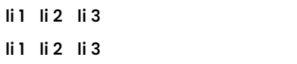

# Get Started

_<mark style="color:red;">"It is not made for replacing existing library , It is made to make websites and UIs faster "</mark>_

## How to Start ?

To start with a basic project check [Set-Up](../installation/set-up.md) page to make first website with **NextGenCSS🔥**


## Basic CSS&#x20;

The basic CSS file includes a some basic styles for every element

```scss
html {
    font-size: 16px; // root element size
}
```

```scss

*{
    //base
    margin:$default-margin;
    padding:$default-padding;

    //font
    font-family: $default-font;

}
```

```scss

// css for all h tags
// Define font-size utility classes for heading tags
h1 {
      font-size: 2rem; 
    }
h2 {
      font-size: 1.5rem; 
    }
h3 {
      font-size: 1.25rem; 
    }
h4 {
      font-size: 1rem; 
    }
h5 {
      font-size: 0.875rem; 
    }
h6 {
      font-size: 0.75rem;
    }
  
```

```scss

text {
    font-family: $text-font;
}


a{
  text-decoration: none;
  cursor:pointer;
}


ol{
	list-style: decimal;
}

ul{
	list-style: circle;
}

li{
	display: inline-block;
	margin-right: 0.625rem;
}
```

```scss

hr{
	padding : 0rem;
	border-top: 0.0625rem solid Get-Color('dark');	
}

```

All these are some basic code for elements

For faster🔥 Development , We have `:after`  on `.link` class&#x20;

```scss
.link::after{
	color:Get-Color('gray');
}
```


## Examples🔥

### 🔥 Heading tags

```html
<h1>This is h1 tag</h1>
<h2>This is h2 tag</h2>
<h3>This is h3 tag</h3>
<h4>This is h4 tag</h4>
<h5>This is h5 tag</h5>
<h6>This is h6 tag</h6>
```


<figure><figcaption><p>Output</p></figcaption></figure>

### 🔥 Anchor Tag

```html
<a href="#">This is an anchor tag</a>
<a href="#" class="link">This is an anchor tag</a> <!-- It will how gray color oh hover --!>
```

<figure><figcaption><p>Second anchor tag is hovered</p></figcaption></figure>


### 🔥 List Example


#### _Unordered List are same as Ordered List by Default_

```
<ul>
<li>li 1</li>
<li>li 2</li>
<li>li 3</li>
</ul>
```

```
<ol>
<li>li 1</li>
<li>li 2</li>
<li>li 3</li>
</ol>
```

<figure><figcaption></figcaption></figure>
